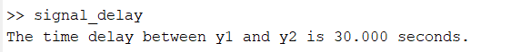
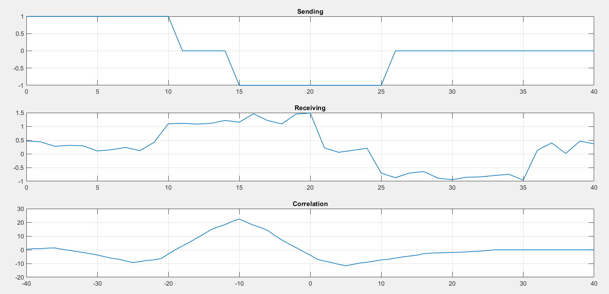

# Digital Signal Processing Sessional
# Course Code: ECE 4124
## Submitted By-
Marjia Afroj

Roll:1810029

Series: 18

Dept. of ECE, RUET

## Submitted to-

Hafsa Binte Kibriya

Lecturer

Dept. of ECE, RUET


<div style='text-align: justify;'>

### 4.1 Experiment No: 04
### 4.2 Experiment Date: May 15, 2023 
### 4.2 Experiment Name: Calculating delay time of a recieving signal using cross correlation in MATLAB

<b > <font size = "3">4.4 Theory: <font></b>

Cross-correlation is a useful technique for estimating the time delay between two signals. It measures the similarity between two signals as a function of the time delay between them. By finding the peak in the cross-correlation function, we can determine the time delay between the signals.

<b>4.5 Used Platform: MATLAB </b>

<b>4.6 Code:</b>

```matlab
t = 0:1:40;
s1 = t>=0 & t<=10;
s2 = (t>=15 & t<=25)*(-1);
y1 = s1+s2;
subplot(3,1,1);
plot(t,y1);
title("Sending")
s3 = t>=10 & t<=20;
s4 = (t>=25 & t<=35)*(-1);
y2 = s3+s4;
y2 = y2+0.5*rand(size(y2));
subplot(3,1,2);
plot(t,y2);
title("Receiving");

y = xcorr(y1, y2);

[max_val, max_idx] = max(abs(y));

time_delay = (max_idx - 1);
lag = -length(y1)+1:length(y1)-1;

subplot(3,1,3);
plot(lag,y);
title("Correlation");
fprintf('The time delay between y1 and y2 is %.3f seconds.\n' time_delay);
```

<b>4.7 Output:</b>

<div align="center">
    
    
    <p style="text-align: center;">Figure 1.1: Graphical Representation of Time delay between two signals</p>
</div>

<b>4.8 Discussion:</b>

In this experiment, cross correlation was applied to calculate the time delay between two signals. The peak index of the correlated signal was the time delay of the signal.

<b>4.9 Conclusion:</b>

The experiment was performed succesfully. The received output was similar to the theory.

</div>

